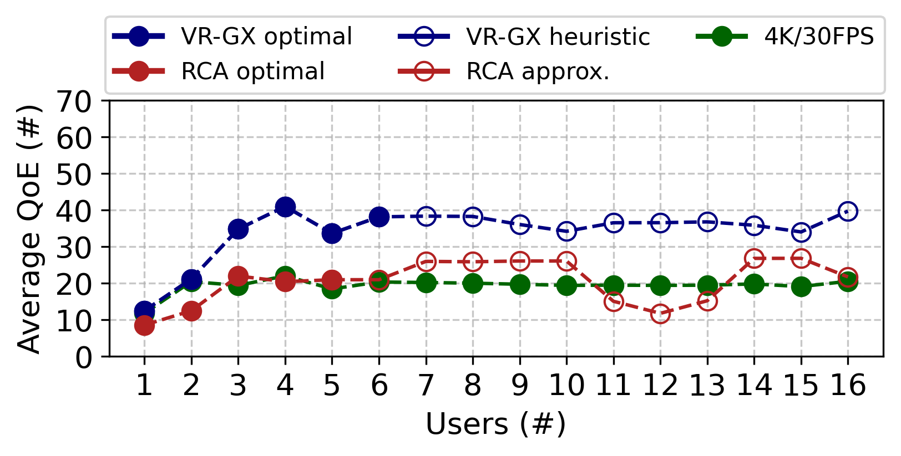
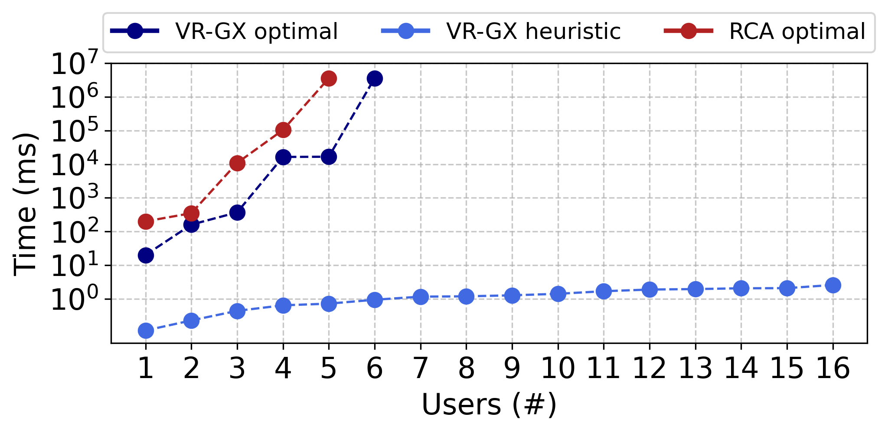

# VR-GX: an Attention-aware QoE-based resource allocation model for VR-Cloud Gaming

This repository contains the implementation and evaluation scripts of the paper:

> Gabriel M. Almeida, João Paulo Esper, Luiz A. DaSilva, Kleber V. Cardoso.  
> "VR-GX: an Attention-aware QoE-based resource allocation model for VR-Cloud Gaming".  
> In: Proceedings of the 43rd Brazilian Symposium on Computer Networks and Distributed Systems (SBRC 2025).

## Overview

VR-GX is a resource allocation model for Virtual Reality Cloud Gaming (VR-CG) applications. The model optimizes computing and communication resources while considering user attention levels, enabling dynamic resolution and frame rate adaptation, compliant with 3GPP specifications.

This repository provides:

- The mathematical formulation of the VR-GX optimization problem.
- The heuristic algorithm designed for fast and efficient approximations.
- Scripts to reproduce the simulation scenarios and performance evaluation.
- Dataset of user attention levels used in the experiments.
- Figures and plots presented in the paper.

---

## Repository Structure

```
paper-GJLK-2025/
│
├── RCA_model/                      # Implementation of Rendering Capacity Allocator (RCA) model - from literature
│   ├── classes.py/                 # Classes used by the RCA model and simulation
│   ├── methods.py/                 # Methods used to build the RCA model and simulation
│   ├── model.py/                   # RCA optimization model implementation using docplex
│   └── run_model.py/               # Script used to run the RCA optimization model
│
├── heuristic_algorithm             # Implementation of the heuristic proposed in the paper
│   ├── classes.py/                 # Classes used by the heuristic algorithm and simulation
│   ├── methods.py/                 # Methods used to build the heuristic model and simulation
│   ├── heuristic.py/               # Heuristic implementation
│   └── run_heuristic.py/           # Script used to run the heuristic algorithm
│
├── input_scenarios/                # Input files used to create the evaluation instances
│   ├── BSs/                        # Input files with Base Stations (BSs) information
│   │    └── 4_BNs.json/             Define the scenario with 4 BSs
│   ├── Labels/                     # Define the labels of objects in each virtual scene (more information [here](https://github.com/HongyangDu/User-Object-Attention-Level)!
│   │    └── i_txt.json/            # i-th image labels file
│   ├── MEC_servers/                # Input files with MEC servers information
│   │    └── 2_MEC_servers.json/    # Define the scenario with 2 MEC servers
│   ├── users/                      # Input files with users information
│   │    └── k_users.json/          # Input file with k users
│   └── my_rating.csv/              # User's attention to virtual objects (more information [here](https://github.com/HongyangDu/User-Object-Attention-Level)!
├── optimization_model/             # Implementation of VR-GX optimization model
    ├── solutions/                  # Solutions file containing the output for VR-GX, heuristic and RCA models
│   │     └── plots/                # Scripts used to plot the result
│   ├── classes.py/                 # Classes used by the VR-GX model and simulation
│   ├── methods.py/                 # Methods used to build the VR-GX model and simulation
│   ├── model.py/                   # VR-GX optimization model implementation using docplex
│   └── run_model.py/               # Script used to run the VR-GX optimization model
│
└── README.md           # This file
```

## Running the Code

### Dependencies

- Python 3.10+
- CPLEX (IBM ILOG CPLEX Optimization Studio) v.22.11+
- docplex v2.29+
- numpy v2.2+
- pandas v.2.2+
- matplotlib v.3.10+

Inside any optimization implementation, run:

```
python3 run_model.py <number_of_BSs> <number_of_users> <number_of_MEC_servers>
```

To run the heuristic:

```
cd heuristic_algorithm
python3 run_heuristic.py <number_of_BSs> <number_of_users> <number_of_MEC_servers>
```

Once all experiments is finished, plot the results with:

```
cd optimization_model/solutions/plots
python3 make_plots.py

```

### Average QoE comparison



### Processing time comparison



## How to cite:
```
@inproceedings{almeida2025vrgx,
  author    = {Gabriel M. Almeida and Jo{\~a}o Paulo Esper and Luiz A. DaSilva and Kleber V. Cardoso},
  title     = {VR-GX: an Attention-aware QoE-based resource allocation model for VR-Cloud Gaming},
  booktitle = {Anais do XLII Simpósio Brasileiro de Redes de Computadores e Sistemas Distribuídos},
  year      = {2025}
  doi       = {TBD}
}
```

@inproceedings{almeida:24, author = {Gabriel Almeida and Mohammad Abdel-Rahman and Kleber Cardoso}, title = { Constraint-Aware Deep Reinforcement Learning for vRAN Dynamic Placement}, booktitle = {Anais do XLII Simpósio Brasileiro de Redes de Computadores e Sistemas Distribuídos}, location = {Niterói/RJ}, year = {2024}, keywords = {}, issn = {2177-9384}, pages = {337--350}, publisher = {SBC}, address = {Porto Alegre, RS, Brasil}, doi = {10.5753/sbrc.2024.1379}, url = {https://sol.sbc.org.br/index.php/sbrc/article/view/29803} }
